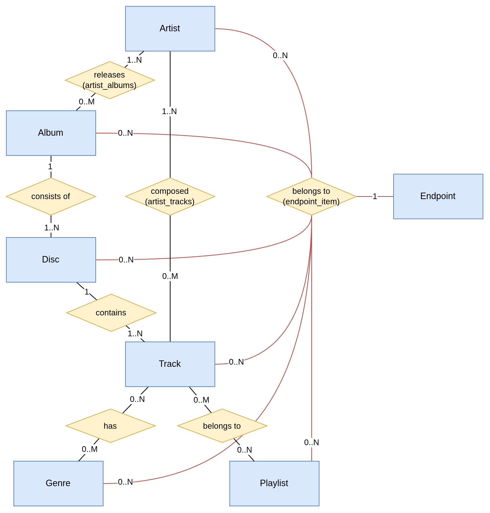

# Endpoint functionality

Leidenfrost is planned to allow using multiple different music endpoints. Currently planned are:

- [Jellyfin](https://jellyfin.org/)
- [Navidrome](https://www.navidrome.org/)
- [Spotify](https://spotify.com/)
- local filesystem

Beyond selecting just one of these, it is planned that Leidenfrost allows using multiple endpoints in conjunction.

## Indexing

This requires an endpoint to be indexable, meaning Leidenfrost can cache the entirety of the endpoint library in its internal DB.
Otherwise using multiple endpoints would break pagination or sorting:
- We would need to disable pagination to fetch ALL entries so we can sort them ourselves
- We would need to disable sorting since fetches pages are not guaranteed to contain the same ranges of order. \
  (Endpoint A could return entries A.. to C.. on page one, while endpoint B returns entries A.. to G.. on page one)

*Search and specific album/artist pages work as usual, since these are not meant to be ordered.*

Indexing an endpoint requires the endpoint library to be finite, we can instead define the endpoint library to be a subset of its actual metadata.
In the following the strategy for endpoints which require this course of action will be described:

### Spotify

In Spotify the library is defined as the users *Liked Songs* playlist.

Alternatively we might instead define the library as the users *Your Library* section, which contains
*Liked Songs*, as well as other Albums/Artists the user has added to their library.

## Database

To allow Leidenfrost to index these libraries we make use of an SQLite database and SeaORM.

The database schema should look like this:

